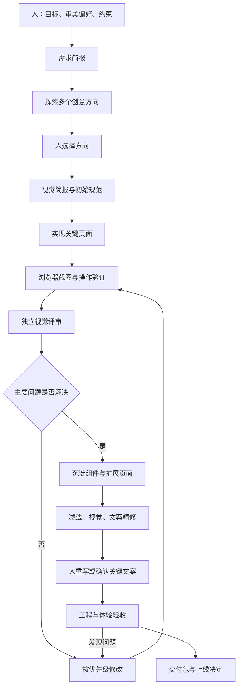

# AI 前端设计工作手册

版本：1.1  
适用范围：品牌官网、产品落地页、Web 应用、管理后台及现有产品的页面扩展。  
目标：稳定产出符合产品用途、具有识别度、细节完整且可以交付的前端。

快速入口：[按任务选择路线](guides/start.md) · [独立模板文件](templates/README.md) · [可运行实践案例](examples/meeting-notes/README.md)

## 1. 使用说明与方法来源

本手册将设计探索、视觉实现、独立评审和工程验收串成一个可执行流程。它是工作方法与架构建议，不表示已经搭建自动化系统。

方法来源：Anshu Chimala 的《How to turn your AI into a world-class designer》中的 Discover、Define、Deliver 三阶段，以及随机种子、具体创意简报、独立评审、图像与视频生成、减法精修等方法。技巧 7、8 根据用户提供的总结整合。需求管理、目录结构、设计规范、工程验收、预算和版本管理为本手册补充。

原文：https://www.lennysnewsletter.com/p/how-to-turn-your-ai-into-a-world

每个项目首先复制本文的模板，填写真实需求。已有项目先阅读仓库规则、技术栈和设计系统；不要为套用本流程重建已有工程。

## 2. 核心工作原则

1. **业务先行。** 明确用户要完成的任务，再讨论风格。
2. **探索与实现分开。** 先比较概念，再投入完整实现。
3. **特色需要具体表达。** 用构图、字体、素材和交互定义特色，避免只写“高级、现代”。
4. **先做代表页面。** 先验证一个关键页面或关键操作闭环，再扩展全站。
5. **评审必须看真实效果。** 代码整洁不能证明视觉完成度；截图好看也不能证明交互可用。
6. **规范随验证沉淀。** 初始规范允许调整，方向稳定后统一复用。
7. **增加与删除同等重要。** 每个元素都应支撑理解、操作或品牌表达。
8. **自动评分只作参考。** 不能通过持续加装饰或迎合评分替代质量判断。
9. **人保留关键决策。** 人确认业务事实、核心创意、关键文案和上线决定。

## 3. 总体架构

### 3.1 四层结构

| 层级 | 组成 | 主要职责 |
| --- | --- | --- |
| 决策层 | 产品负责人、设计负责人，可由同一人担任 | 定义目标、选择方向、确认事实和最终交付 |
| 工作层 | 研究、设计、实现、视觉评审、文案与验收角色 | 分阶段执行工作，形成明确输出 |
| 资产层 | 需求文档、参考图、设计规范、组件、素材、决策记录 | 保存上下文，防止每一轮重新猜测 |
| 验证层 | 浏览器、截图、操作检查、适当的自动化检查 | 验证视觉、功能、响应式和工程质量 |

这些是职责角色，不要求部署多个模型或多个 agent。一个 AI 可以按阶段顺序承担多个职责；只有独立视觉评审需要尽量隔离上下文。



### 3.2 角色分工

| 角色 | 输入 | 输出 | 边界 |
| --- | --- | --- | --- |
| 产品负责人／用户 | 业务背景、真实事实 | 目标、优先级、约束、决定 | 不把业务事实交给 AI 编造 |
| 流程协调者 | 当前阶段、文档和反馈 | 下一步任务、工作记录 | 控制范围、预算和停点 |
| 创意设计者 | 需求、参考与偏好 | 概念、视觉简报、素材方案 | 不在方向未定时完成整站 |
| 前端实现者 | 视觉简报、规范、技术约束 | 可运行页面、组件与状态 | 不擅自新增产品需求 |
| 视觉评审者 | 当前截图、目标与参考图 | 有位置、有理由的改进建议 | 不读取实现理由和历轮评分 |
| 文案审阅者 | 页面文案、业务事实、语气要求 | 清楚准确的文案 | 不虚构评价、指标和承诺 |
| 验收者 | 可运行页面、验收清单 | 缺陷、验证结果、交付状态 | 不以截图代替实际操作 |

最小配置：一名负责人 + 一名实现 AI + 一次独立评审会话 + 浏览器。复杂项目再考虑多人或多 agent，成本高的模型优先用于难点决策和评审，具体效果以项目实际表现为准。

## 4. 项目文件与上下文架构

建议新增以下文件；如果仓库已有相应文档，则复用原位置，不建立两份互相冲突的标准。

```text
project/
├─ AGENTS.md                       # 简短规则、文档入口、运行命令
├─ docs/design/
│  ├─ brief.md                     # 业务与需求事实
│  ├─ directions.md                # 候选方向、选择理由
│  ├─ visual-brief.md              # 当前视觉方向
│  ├─ design-system.md             # 色彩、排版、布局、组件、动效规则
│  ├─ page-map.md                  # 页面、内容、主要操作和状态
│  ├─ copy.md                      # 关键文案与事实核对状态
│  ├─ asset-manifest.md            # 素材来源、用途、权利与文件位置
│  ├─ decisions.md                 # 重要决策及原因
│  ├─ status.md                    # 当前阶段、下一步、阻塞和预算
│  ├─ acceptance.md                # 验收标准与结果
│  └─ reviews/
│     ├─ round-01.md               # 本轮视觉反馈
│     └─ round-02.md
├─ design/references/              # 获准使用的参考图
├─ artifacts/design/               # 截图、演示和验收记录
├─ public/assets/                  # 实际随产品交付的素材，按项目调整
└─ src/                            # 沿用项目技术栈和代码结构
```

文件职责要清楚：brief 保存业务事实；visual-brief 保存创意方向；design-system 保存实施规则；status 保存进度。不要把临时讨论全部塞进 AGENTS.md。

### 4.1 上下文传递规则

- 实现者读取需求、视觉简报、规范及当前任务。
- 视觉评审者只接收最新截图、页面目标、已选方向、参考基准和必要限制。
- 不向视觉评审者提供实现代码、投入时长、之前的辩护理由或“必须给高分”的目标。
- 评审记录保留给协调者与实现者；新一轮评审仍使用同一套评价框架。
- 每轮任务都标明输入文件、允许修改的范围、完成标准和预算。
- 新会话先读 status，再按需读其他文件，避免从零开始。

## 5. 首次设计的完整流程

### 阶段 0：项目接入与边界确认

**目的：** 确认实际工程条件和任务范围。

**执行：**

1. 阅读现有项目规则、依赖、组件库、样式方案和运行方式。
2. 判断是全新设计、局部改版，还是沿用成熟设计系统。
3. 记录需要保留的页面、数据接口、业务流程与品牌资产。
4. 明确本次交付是概念、可交互原型，还是可上线版本。
5. 写清时间、付费素材／生成服务预算及部署授权范围。

**输出：** brief、status 初稿。

**通过条件：** 能说明“本次交付什么、给谁使用、如何验证”。缺少颜色偏好可以继续探索；缺少关键业务规则则应先问清相关部分。

### 阶段 1：需求与内容建模

**目的：** 先确定页面要表达什么、用户要做什么。

**执行：**

- 列出目标用户与主要使用场景。
- 每个页面确定一个首要任务，区分次要操作。
- 建立页面地图和核心路径。
- 准备真实或明确标注为示例的标题、数据和内容。
- 定义加载、空数据、错误、成功、禁用等适用状态。
- 确认语言、设备范围、内容长度与无障碍需求。

**输出：** brief、page-map、copy 初稿。

**通过条件：** 不看视觉稿也能理解页面的价值和主要操作。业务后台尤其应先验证任务流程，避免用品牌展示的方式设计高频操作界面。

### 阶段 2：探索创意方向

**目的：** 找到适合产品且彼此不同的方向。

**执行：**

1. 根据项目规模提出少量差异明确的简短概念，暂不详细实现；需要广泛探索时可扩展到约 8–12 个，不把数量当作完成标准。
2. 从构图、信息组织、字体、图像语言和交互方式上拉开差异。
3. 结合人的偏好筛出 2–3 个，必要时做低成本首屏或关键组件草图。
4. 比较产品适配、识别度、可读性、可扩展性与实现成本。
5. 负责人选定一个方向，记录放弃其他方向的原因。

**随机种子可选：** 当输出反复雷同时，用脚本生成随机字符串作为灵感扰动，记录种子和结果。种子不进入页面，也不能覆盖业务约束；记录种子不能保证模型严格复现结果。

**输出：** directions、参考图及选择记录。

**通过条件：** 能用具体设计特征解释方向差异，而不是只有不同的颜色或风格名称。

### 阶段 3：定义视觉身份

**目的：** 把选中的概念变成可执行规则。

**执行：**

- 写明希望用户感受到什么，例如沉静、精密、轻快或探索感。
- 定义布局逻辑、字体层级、语义色、间距、容器、边框、圆角和阴影。
- 选择 1–2 个主要识别特征，不要求每个区域都有“惊喜”。
- 说明素材用途、构图、裁切与移动端策略。
- 定义动效触发、目的、节奏与减少动态效果时的替代方案。
- 对参考图逐一标注借鉴点和不采纳的部分。

**输出：** visual-brief、design-system 初稿。

**通过条件：** 实现者可以据此做出有一致性的页面，不需要每一步重新猜审美。

### 阶段 4：实现代表页面

**目的：** 用真实浏览器中的页面检验设计。

**选页规则：** 官网可选包含首屏与典型内容区的首页；后台可选核心列表及详情；工具产品可选最关键的操作闭环。不要只做一个与其他页面无关的漂亮封面。

**执行：**

1. 先实现内容与语义结构，再落实排版、颜色和素材。
2. 采用项目现有技术栈与基础组件，必要时做受控扩展。
3. 明确区分已接入能力、演示数据和未完成操作。
4. 验证主要交互，补齐代表性的状态。
5. 在桌面和移动端查看实际布局，保存截图。

**输出：** 可运行代表页面、截图、问题列表。

**通过条件：** 核心路径可以演示；无阻碍评审的断图、溢出或明显布局错误。

### 阶段 5：独立视觉评审与定向迭代

**目的：** 找到最影响完成度的差距。

**每轮输入：** 页面目标、设计方向、必要约束、同一视口下的当前截图和少量专业参考图。对于长页面提供关键区段；对于动效另做过程验证。

**评审维度：**

| 维度 | 具体检查 |
| --- | --- |
| 产品适配 | 是否符合用户任务、品牌语气和使用环境 |
| 构图与层级 | 焦点是否明确，内容顺序是否自然，密度是否合理 |
| 字体与间距 | 字号、行高、行长、对齐、间距是否协调 |
| 视觉身份 | 特征是否一致且有识别度，是否机械套用模板 |
| 素材融合 | 色调、裁切、光影、清晰度与背景是否匹配 |
| 细节完成度 | 边界、图标、控件、状态是否一致 |

**每条反馈格式：** 位置 → 观察 → 对用户或视觉的影响 → 修改建议 → 优先级。

优先级：P0 阻断任务或造成严重误解；P1 明显损害核心体验或整体视觉；P2 局部精修。视觉问题通常为 P1/P2，不用严重等级夸大一般审美偏好。

**迭代规则：**

- 每轮优先处理最多 3 个高影响问题。
- 每轮根据问题决定是否继续；修复已发现问题并复核后可以结束。两轮可作为预算参考，额外迭代应说明尚未解决的具体问题。
- 记录采纳和拒绝建议的理由，不能机械执行相互矛盾的意见。
- 参考图用于质量和方法比较，不等于复制目标。
- 如使用评分，应保留维度理由；不以单次总分作为交付条件。

**通过条件：** 没有未处理的 P0/P1；方向稳定；主要修改已在浏览器复核。轻微偏好分歧可记录后交由负责人决定。

### 阶段 6：特色素材与动效深化

本阶段按需执行，可以在阶段 4 前先制作关键素材，也可以与阶段 5 交替。

**使用图像的条件：** 主视觉、场景图、纹理或插画能够承担明确的内容和品牌作用。基础图标、简单几何形状优先用现有图标系统或 SVG。

**使用视频／3D 的条件：** 复杂运动、产品变化或空间展示对理解和体验有价值。高频业务操作区不应被装饰性效果干扰。

**素材需求单必须包含：**

- 用途、放置区域与视觉焦点。
- 比例、目标尺寸、背景、文字预留空间与安全裁切区。
- 色调、材质、光线及禁止出现的内容。
- 输出格式、来源、权利核对状态和文件位置。
- 桌面／移动端加载方式，以及失败或性能不足时的替代方案。

**动效检查：** 首帧、过程、结束和中断状态均自然；滚动联动不妨碍内容阅读；尊重 prefers-reduced-motion；无视频时关键内容仍可理解。不要用某一帧截图证明整段动效正确。

**通过条件：** 素材已整合、来源有记录、裁切正确，且没有明显破坏加载性能或操作流畅度。

### 阶段 7：沉淀规范与扩展页面

**目的：** 把成功的设计变成稳定可复用的系统。

**执行：**

1. 更新设计 token、基础组件、复用区块和页面模板。
2. 明确组件变体和适用状态，减少局部随意覆写。
3. 按 page-map 扩展页面，以同一规范表达不同内容。
4. 对新增布局和新型组件做重点评审。
5. 修改公共组件后，检查受影响的代表页面。

**通过条件：** 页面保持同一视觉语言，内容组织仍符合各自任务；不是所有页面都复制同一套卡片。

### 阶段 8：减法与两轮去痕检查

**8A：价值减法**

逐项判断内容和组件是否帮助理解、操作或建立品牌感受。删除重复说明、无依据的指标、无用容器、装饰性标签与竞争主操作的元素。

**8B：视觉检查**

检查机械重复的布局、过量的渐变／发光／玻璃效果、失控的字体、过密或过散的间距、没有语义的强调色、低质量自定义控件。尽量保持文案不变，比较前后截图。

常见元素不是禁用元素。任何建议都应指出具体不适配之处；若当前实现合理，可保持不变。

**8C：文案检查**

保持结构稳定，检查套路句式、铺垫、空泛动词、均匀机械的句子节奏、重复解释、含糊操作和未经证实的承诺。完成后检查换行、按钮宽度和移动端。

**输出：** 可核对的变更差异和截图。

**通过条件：** 核心信息仍完整，噪声减少，可操作性未下降。精简不能删除必要标签、错误说明或无障碍信息。

### 阶段 9：人工确认关键文案

**目的：** 让产品表达符合真实业务和真实客户。

负责人朗读标题及关键文案，并检查：

- 我会这样向客户介绍产品吗？
- 客户能知道产品做什么、接下来做什么吗？
- 文案与真实行为是否一致？
- 是否承诺了无法保证的效果？

重点范围：首屏标题、副标题、主要按钮、空状态、错误、成功反馈、价格与权限说明。专业场景保持必要精确度，不强求口语化。

AI 可提供候选表达并统一术语；事实核对和重要承诺由负责人确认。

**通过条件：** 关键文案标记为已确认；未确认的营销事实不进入正式交付。

### 阶段 10：工程验收与交付

**目的：** 区分“看起来完成”和“能实际使用”。

**验收范围：**

- 主要页面与路径、链接、按钮、表单、导航和返回行为。
- 适用的加载、空、错误、成功和禁用状态。
- 桌面、平板、移动端布局，长标题与真实内容长度。
- 键盘操作、可见焦点、语义标签、表单错误关联、颜色对比度。
- 素材尺寸、字体加载、布局位移与明显卡顿。
- 项目规定的构建、类型、代码检查和已有测试。
- 新增关键逻辑的针对性测试；纯样式微调以视觉验证为主，避免编写只复述实现的测试。
- 示例数据、未接通能力、来源未确认素材与已知问题是否清楚标注。

建议将 WCAG 2.2 AA 作为适用的无障碍基准；一般文本对比度至少 4.5:1，大号文本至少 3:1，具体按标准和页面场景核对。自动检查通过不等于完整符合标准。

性能参考：有条件时关注 LCP、INP、CLS；真实用户数据的良好阈值通常为 LCP ≤ 2.5 秒、INP ≤ 200 毫秒、CLS ≤ 0.1（第 75 百分位）。本地测量不能证明线上真实用户达标，记录测试环境与局限。

**输出：** 交付包、验收结果、已知问题与运行说明。

**通过条件：** 满足项目约定的完成定义。部署或公开发布按项目授权执行，完成设计不自动代表允许上线。

## 6. 后续新增页面的简化流程

成熟设计系统下，不再每次完整探索。

```text
读取现有规范
→ 明确新页面任务、内容与状态
→ 选择现有页面模板和组件
→ 实现页面
→ 浏览器验证
→ 重点评审新增布局与组件
→ 文案和必要的视觉精修
→ 更新规范与验收记录
```

只有遇到新品牌定位、新受众、新交互类型或现有规范明显无法承载需求时，才返回创意探索阶段。单个页面内容不同，不构成重做设计系统的理由。

## 7. 返工、停止与预算规则

| 发现的问题 | 返回阶段 | 处理方式 |
| --- | --- | --- |
| 产品价值或主要任务不清楚 | 阶段 1 | 重写需求和内容层级 |
| 多次精修后仍与品牌不符 | 阶段 2–3 | 调整方向，避免继续堆细节 |
| 构图正确但实现粗糙 | 阶段 4–5 | 聚焦排版、间距、素材和组件 |
| 素材不匹配 | 阶段 6 | 修改素材需求或替换资产 |
| 新页面风格漂移 | 阶段 7 | 修正规范和公共组件 |
| 文案变化造成溢出 | 阶段 8–10 | 修复布局并回归相关页面 |
| 功能或无障碍缺陷 | 阶段 4／10 | 定位具体缺陷，修复后验证 |

全新视觉项目的探索预算可参考 8–12 个文字方向、2–3 个低成本候选、1 个深入实现方向，评审可预留两轮。这些是预算参考，不是必经数量；小改动可直接实现并验证，方向已明确时无需重新探索。

开始前约定：总时间、付费服务额度、素材生成次数或成本上限、额外评审预算。达到上限时保存当前最佳版本、列出剩余问题，由负责人调整范围或预算；不宣称已经完成，也不无限继续。

暂停深化的信号：连续两轮没有明确改善、反馈互相矛盾、主要修改只是迎合评分、装饰增加但任务更难完成。此时整理争议，返回方向或由人裁决。

方向确认、代表页面通过、扩展完成、交付前应保留可恢复版本。已有代码使用项目版本管理习惯；未提交的用户工作应妥善保留。

## 8. 可直接复制的工作模板

### 8.1 需求简报模板

```text
项目／产品：
本次范围：
交付级别：概念 / 可交互原型 / 可上线版本
目标用户与主要场景：
用户最重要的任务：
核心路径与成功结果：
页面清单：
真实内容与素材来源：
品牌特征与不希望出现的感受：
现有技术栈、组件库与必须保留的能力：
数据接口与演示数据边界：
语言、设备、浏览器与无障碍要求：
本次不做的内容：
时间、付费服务预算与迭代上限：
验收方式与负责人：
上线授权范围：
未知事项及当前假设：
```

### 8.2 视觉简报模板

```text
方向名称：
一句话描述：
与产品任务的关系：
希望用户感受到的三个词：
参考图：每张的借鉴点与不采纳部分
构图与信息组织：
字体与层级：
配色与语义用途：
布局、间距和密度：
组件、边框、圆角和阴影：
主要识别特征（1–2 个）：
图片／视频的用途与规格：
动效目的及静态替代：
移动端如何重排：
需要避免的具体模式与理由：
方向确认人和日期：
```

### 8.3 单轮任务卡模板

```text
任务名称与当前阶段：
读取文件：
本轮目标：
允许修改的页面／组件：
需要保留的业务行为：
优先解决的问题（最多 3 个）：
输出文件与截图：
完成标准：
验证方法：
本轮时间／成本上限：
需要负责人判断的问题：
```

### 8.4 评审记录模板

```text
轮次、日期与版本：
页面、视口与截图位置：
目标和参考基准：

问题编号：
具体位置：
可观察的问题：
影响与优先级：
建议修改：
采纳／拒绝及理由：
修改后的验证结果：

本轮总体结论：通过 / 修改后复核 / 返回上游
尚未验证的内容：
```

### 8.5 进度记录模板

```text
当前阶段：
当前版本与运行方式：
已确认的需求和设计方向：
本轮完成内容：
当前最高优先级问题：
下一步及对应任务卡：
待人确认的事实或决策：
已用／剩余时间与付费预算：
最新截图与评审记录：
```

## 9. 分阶段提示词

以下提示词是工作指令模板；实际使用时替换方括号内容，并提供对应文档。无需把所有阶段一次性塞进同一条超长提示词。

### 9.1 项目接入

```text
请先阅读项目规则和现有实现，核对技术栈、组件库、运行命令与设计规范。
本次要完成【范围】，交付级别是【级别】。
整理需求简报、页面地图、未知事项和建议验收方式。
优先沿用现有工程约定。缺失的信息先区分为可合理假设和必须确认两类。
先完成不依赖答案的工作，不要编造业务规则、客户数据或产品承诺。
```

### 9.2 创意探索

```text
根据需求简报，为【产品】提出 10 个差异明显的视觉方向，先不要完整编码。
从建筑、出版物、工业产品、艺术、游戏或相关领域寻找适合本产品的灵感。
每个方向说明：概念、感受、构图、字体与素材语言、一个记忆点、适配理由和成本风险。
不要只给同一种结构换配色。方向必须保持内容可读和主要操作清楚。
推荐 3 个候选并解释取舍，等待负责人选定后再深入。
```

### 9.3 方向具体化与实现

```text
选定方向为【方向】，偏好为【喜欢的特征】，需要避免【特征及理由】。
结合参考图写出视觉简报和初始设计规范。
参考图用于质量与语言分析，不直接复制。
随后实现【代表页面／核心路径】，沿用项目技术栈。
使用符合业务的真实或明确标注的示例内容，记录未接入能力。
在浏览器查看桌面和移动端效果，验证主要操作并保存截图。
```

### 9.4 独立视觉评审

```text
你负责独立视觉评审。附件包含当前截图、页面目标、视觉方向和参考图。
请仅基于这些材料判断，不假设实现成本，也不猜测不可见的交互表现。
按产品适配、构图层级、字体间距、视觉身份、素材融合和细节完成度检查。
提出最多 3 个最有影响的问题，逐项写明位置、观察、影响、修改建议与优先级。
参考图是质量基准，不是复制目标。避免含糊地要求“更高级”。
如果没有明显问题，可以建议保持现状。说明截图无法验证的事项。
```

### 9.5 根据评审修改

```text
阅读本轮评审，对每条建议判断是否符合已确认需求和视觉方向。
先修复高影响问题；不采纳的建议写清理由。
本轮仅处理【问题范围】，不要擅自增加功能或更换整体风格。
修改后用相同视口保存截图，验证受影响的操作与公共组件。
更新评审记录和当前状态。
```

### 9.6 素材与动效

```text
为【区域】制定素材方案，作用是【产品表达目的】。
明确构图、主体、文字预留区、颜色、背景、比例和移动端裁切。
先判断现有资产、SVG、图像生成、视频或 3D 中哪种适合任务和预算。
仅在已授权工具和费用范围内制作素材，记录来源和文件位置。
整合后验证加载、裁切和动效过程，并提供静态或低动态替代方案。
```

### 9.7 价值与视觉检查

```text
先做价值减法，再做视觉检查，分别记录修改。
检查重复内容、多余容器、无意义标签、竞争主操作的装饰，提出有理由的删减。
随后检查机械重复布局、过量效果、字体和间距失衡及组件不一致。
不要把常见元素一律禁用；任何修改都应有与当前页面相关的理由。
尽量保持文案稳定，保留必要信息和无障碍标签，输出前后差异与截图。
```

### 9.8 文案检查

```text
本轮专门审阅文案，暂不改变视觉方向。
检查空泛表述、套路句式、重复解释、机械节奏、含糊按钮和不明确的恢复提示。
保持业务事实准确，不添加未经证实的指标、评价、效果保证或功能。
列出原文、建议文本及理由，将关键标题和产品承诺交负责人确认。
替换后检查长文本、换行、按钮尺寸及移动端布局。
```

### 9.9 最终验收

```text
按项目验收清单检查实际页面，分别报告视觉、功能、响应式、无障碍和工程结果。
运行项目要求且与本次改动相关的检查，实际操作核心路径。
对未运行或无法验证的项目明确标注，不将“未发现”写成“已通过”。
交付运行方式、修改范围、截图、验证记录、已知问题和未接通能力。
按现有授权范围处理部署；没有发布授权时交付可审阅结果。
```

## 10. 前端实现架构建议

具体目录按现有框架调整，不强制选择 React、Vue、Next.js 或某个 CSS 工具。

```text
设计 token
  ↓
基础组件：按钮、输入框、标签、弹窗、提示
  ↓
业务组件：表单区、数据表、产品展示、导航
  ↓
页面模板：详情、列表、落地页、编辑页
  ↓
具体页面与路由
```

### 10.1 设计 token

- 颜色使用语义名称，如 background、surface、text、muted、accent、danger，避免每页随意指定颜色。
- 明确字体家族、字号层级、字重、行高和字距；中文界面验证字体实际可用性与混排效果。
- 间距使用有限尺度并按内容需要调整，不把固定倍数当作审美保证。
- 定义内容宽度、边框、圆角、阴影、层级及动效参数。
- 需要主题切换时才建立对应主题，不为尚不存在的需求增加复杂度。

### 10.2 组件与状态

每个交互组件按需要覆盖默认、悬停、聚焦、按下、禁用、加载、错误和成功状态。不是每个组件都需要所有状态。

优先使用语义 HTML 与成熟可访问组件。品牌外观可以定制，键盘行为和状态语义应保持可靠。静态装饰不必强行抽象成复杂公共组件。

### 10.3 响应式

先确定内容优先级，再决定隐藏、折叠、重排或横向滚动。断点根据布局何时失效来设定，不能只压缩桌面版。

可选检查宽度：360、390、768、1280、1440 CSS 像素，结合目标设备删减；还应检查断点之间、长文案、放大文字和横向溢出。固定宽度截图不能替代连续缩放检查。

### 10.4 数据与安全边界

演示数据与正式数据接口分清；占位按钮标明演示范围，不将假操作报告为功能完成。生成工具的凭据仅用于授权开发环境，不写入浏览器代码、公开仓库或交付素材。

## 11. 完成定义与交付包

### 11.1 按交付级别区分

| 级别 | 必须完成 | 允许保留的限制 |
| --- | --- | --- |
| 概念稿 | 方向、关键视觉与说明 | 可不接数据和交互，但明确标注 |
| 可交互原型 | 代表路径、适用状态、响应式演示 | 可使用示例数据，未接能力有记录 |
| 可上线版本 | 约定功能、真实接口、完整验收、资产核对 | 仅保留经负责人接受且不阻断上线的问题 |

### 11.2 最终检查清单

- [ ] 目标用户与主要任务清楚。
- [ ] 视觉方向有明确选择理由，并得到负责人确认。
- [ ] 代表页面通过实际浏览器评审。
- [ ] 设计规范、组件与其他页面保持一致。
- [ ] 图片和动效服务于内容，来源与交付用途已核对。
- [ ] 已做价值减法、视觉检查和文案检查，并记录必要差异。
- [ ] 关键文案和业务事实由负责人确认。
- [ ] 主要路径及适用状态已验证。
- [ ] 响应式、键盘操作和重点无障碍项目已检查。
- [ ] 项目要求的相关工程检查已完成并记录结果。
- [ ] 无未处理的阻断问题；剩余限制有明确说明。
- [ ] 运行方式、修改范围和交付级别已写清。

### 11.3 交付内容

源码或项目变更、运行说明、需求与视觉简报、设计规范、页面地图、关键文案、素材清单、代表截图、评审与验收记录、已知问题。按项目已有习惯提供预览链接或部署产物。

## 12. 首次采用本流程的执行路线

1. 选择一个真实且范围适中的页面或核心路径。
2. 填写需求简报，准备内容与少量参考图。
3. 探索多个方向，由负责人选择一个。
4. 写视觉简报并制作代表页面。
5. 做独立截图评审，按发现的问题决定迭代次数，保留修改差异；只有自查条件时如实标记评审方式。
6. 按需加入特色素材，完成减法与文案精修。
7. 实际验收并交付，再将有效规范用于下一个页面。

第一次优先验证流程能否改善结果。积累稳定、重复的检查后，再把视觉检查、文案检查或验收清单封装成 skill；不要过早把尚未验证的个人偏好固化为自动规则。

## 13. 在真实项目中启动与续接

### 13.1 第一次启动时发送什么

将本手册放在项目可读取的位置，并把下面的指令与产品资料一起交给 AI。方括号需要替换；不确定的内容写“待确认”，不要为了填满模板编造信息。

```text
请按【本手册实际路径】组织本次前端设计工作。
项目位置：【路径】
产品及目标用户：【描述】
本次交付：【页面或核心路径；概念／原型／可上线版本】
用户要完成的主要任务：【描述】
现有内容与参考资料：【文件或链接】
必须保留的行为和风格：【约束】
时间与付费预算：【限制；是否允许付费素材生成】

先检查现有项目，复用已有规则和文档，建立最少必要的设计记录。
新项目先完成需求简报与候选方向；已有成熟设计系统则直接规划本次扩展。
业务事实不清楚时列明问题；可合理判断的实现细节自行处理并记录。
我尚未选择视觉方向时，先给出候选及推荐理由，完成不依赖选择的工作。
方向确定后，制作代表页面，进行浏览器验证、评审和定向修改，
再扩展页面、分开检查视觉与文案，并按交付级别验收。
已获得的授权持续有效，不要在每个阶段重复询问。
每次结束时更新 status.md，说明完成项、验证证据、未完成项和下一步。
```

最小项目可以先只建 brief、visual-brief、status 和 acceptance 四份文档；其余记录在需要时拆分。文件数量不是流程完成度的衡量标准。

### 13.2 每轮工作结束时保存什么

实现者应保存以下信息，使下一次会话能够继续：

| 记录 | 最少内容 | 保存位置 |
| --- | --- | --- |
| 当前进度 | 当前阶段、已完成内容、下一步 | status.md |
| 已有决定 | 方向、业务约束、授权范围与来源 | brief.md／decisions.md |
| 当前页面 | 路由、启动命令、所需环境、演示数据边界 | status.md 或已有运行说明 |
| 验证证据 | 版本、视口、截图、实际操作结果 | acceptance.md／reviews/ |
| 剩余问题 | 具体位置、影响、优先级、是否阻断交付 | status.md／acceptance.md |

只有查看过的页面和执行过的检查才能记录为已验证。截图和结果应关联同一个实现版本；修改公共组件后，旧截图不能直接证明新版本通过。

### 13.3 下一次会话如何继续

```text
继续当前前端设计工作。
先读取【status.md 路径】及其引用的需求、视觉规范和验收记录，
再检查当前代码与记录是否一致，保留已有未提交修改。
简要说明当前阶段、尚未完成的最高优先级问题和本轮目标，然后继续执行。
沿用已确认的视觉方向、业务规则和授权，不重新探索已决定的事项。
若实际文件与记录不一致，先核对差异，不把记录中的“完成”当作验证结果。
完成后更新状态、相关截图和验收记录。
```

### 13.4 一条完整的示例路线

以下为虚构的“会议纪要工具”原型示例，只用于解释流程，不代表已实现产品。

1. **定义任务：** 用户上传录音、查看处理进度、阅读并编辑纪要。本轮做原型，使用明确标注的示例内容，不宣称已经接入转写服务。
2. **探索方向：** 比较“编辑工作台”“录音设备”“轻量文档”三个候选，说明排版、密度和素材差异；负责人选择轻量文档方向。
3. **写视觉规则：** 正文优先、低干扰配色、清楚的编辑层级；主要强调色只用于当前操作。具体色值和字号在代表页面验证后保存。
4. **实现代表路径：** 文件选择 → 模拟处理 → 示例纪要 → 编辑 → 保存反馈，补上无文件、格式不支持及模拟失败状态。
5. **实际评审：** 提供桌面和移动端截图。评审者可判断阅读层级与按钮辨识度；上传和保存行为由操作验证确认。
6. **定向修复：** 若发现移动端工具栏挤压正文，先调整重排规则；用相同视口复核，并操作编辑和保存路径。
7. **扩展与精修：** 复用已验证组件完成纪要列表，删除重复引导；分别检查视觉和文案，由负责人核对关键表达。
8. **交付：** 记录原型运行方式、截图、操作结果与限制。“真实上传、转写和持久化未接入”明确写进交付说明，不能标记为可上线版本。

## 14. 补充实施与验收模板

### 14.1 设计规范模板

```text
适用版本、页面与负责人：
关联视觉方向：
语义颜色：用途 / token 名称 / 实际值 / 对比度检查结果
字体层级：用途 / 字体及回退 / 字号 / 字重 / 行高
布局：内容宽度 / 栅格 / 间距尺度 / 页面密度
边界样式：边框 / 圆角 / 阴影 / 使用条件
基础组件：名称 / 变体 / 适用状态 / 代码位置
业务区块与页面模板：适用场景 / 不适用场景
响应式：发生重排的条件 / 重排方式 / 已验证宽度
动效：触发 / 目的 / 时长 / 中断行为 / 减少动态时的替代
素材：文件位置 / 尺寸比例 / 裁切 / 加载与失败回退
已验证的例外及理由：
本次公共规则变更及受影响页面：
```

不要直接填写一套通用 token 后宣布规范完成。实际值应来自本项目的视觉方向与浏览器验证；调整公共值时同步核对依赖它的页面。

### 14.2 验收记录模板

```text
交付级别与本次范围：
验收日期、执行人、实现版本：
运行命令、地址、浏览器与环境：
使用的数据：真实 / 示例 / 混合（说明边界）

验收项编号：
页面、路径或组件：
检查目标：
前置条件与操作步骤：
预期结果：
实际结果：
状态：通过 / 失败 / 未验证 / 不适用
证据：截图路径、检查输出或操作记录
问题优先级、修复情况与复核结果：

未完成的功能与未接入的服务：
仍需负责人确认的事实或文案：
已知问题及其影响：
交付结论与依据：
上线授权与执行情况（如适用）：
```

“不适用”需要简要说明理由；“未验证”不能计入通过项。上线结论应按实际授权、项目完成定义和验证结果判断，不能由检查表数量或视觉分数自动推出。

### 14.3 独立评审交接包

```text
本轮页面目标及目标用户：
已选视觉方向和必要约束：
实现版本、截图日期与视口：
当前截图：
参考图及各自的参考用途：
本轮需要重点判断的范围：

请独立指出最多 3 个高影响问题，提供位置、观察、影响、修改建议和优先级。
不根据截图猜测交互是否有效；说明仍需实际操作验证的部分。
没有明显问题时可以建议通过，不要求每轮必须修改。
```

交接包不包含实现者的辩护、历轮得分或期望结论。只有一个会话时，可以分阶段自查，但应将记录标记为“自查”；需要独立评审时，再交给隔离上下文的评审会话或人工评审者。
