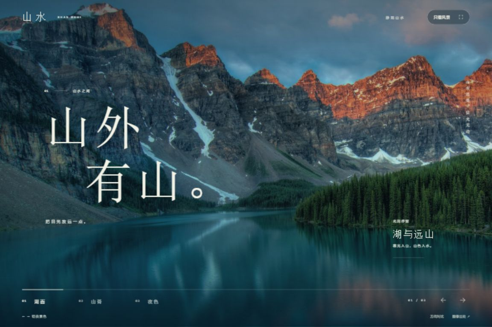

# AI 前端设计工作流

一套用于品牌官网、产品落地页、Web 应用和管理后台的 AI 辅助设计方法，包含工作架构、执行流程、提示词与验收模板。

完整文档：[AI 前端设计工作手册](AI前端设计工作手册.md)

**提示词与 skill：** [可复制提示词库](prompts/README.md) · [随机发散提示词](prompts/random-exploration.md) · [前端发散设计 skill](skills/frontend-divergent-design/SKILL.md)

每轮修改后可用 [项目改动审核员](guides/change-review.md)，核对必要性、范围、事实证据和回归风险；默认只读，复用现有任务与验收记录。

希望摆脱雷同的视觉方案时，先用外部随机组合产生设计假设，再制作实际候选，选择后深化。随机性不保证美观，功能验收与视觉判断分别进行。

## 从这里开始

| 你的任务 | 使用入口 | 重点 |
| --- | --- | --- |
| 首次设计 | [首次设计路线](guides/start.md#首次设计复制指令) | 明确需求、选择方向、先做代表页面 |
| 已有项目改版 | [改版路线](guides/start.md#已有项目改版复制指令) | 保留现有行为，针对具体问题改进 |
| 新增页面 | [新增页面路线](guides/start.md#新增页面复制指令) | 复用现有规范与组件，检查新状态 |

准备工作时直接复制 [templates/ 中的模板](templates/README.md)，下一轮按 [续接指令](guides/start.md#续接指令) 继续。完整流程与原理见工作手册。

## 可运行的山水设计案例

[山水：沉浸长卷](examples/landscape/README.md) 以纯观景网页演示“真实视觉候选 → 方向深化 → 浏览器验证”的过程。保留沉浸长卷、留白画廊、山川图志三份可操作候选，定稿实现三景切换、键盘浏览和纯观景模式。案例包含需求、视觉规范、素材来源、截图、自查及验收记录。



在仓库根目录运行：

```sh
python -m http.server 8765 --bind 127.0.0.1 --directory examples/landscape
```

然后访问 http://127.0.0.1:8765 查看定稿，访问 http://127.0.0.1:8765/explorations/ 比较三份候选。运行页面只需 Python 静态服务器和浏览器，无需安装前端依赖。摄影保留各自许可，见[素材说明](examples/landscape/assets/README.md)。

## 工作路线

需求简报 → 创意探索 → 视觉规范 → 代表页面 → 浏览器验证与独立评审 → 定向修改 → 扩展页面 → 视觉与文案精修 → 验收交付。

已有成熟设计系统的项目，可采用第 6 章的简化流程。

## 内容范围

本项目提供工作手册、提示词、可复制模板及一个可运行的原生 HTML/CSS/JavaScript 案例。它尚未实现自动执行整个工作流的系统，实际项目可自行选择技术栈。

探索数量和评审轮次按任务规模决定；小改动只需任务卡与相关验证。案例目前为实现者自查，不能替代独立评审或真实用户研究。

方法参考 Anshu Chimala 的 [How to turn your AI into a world-class designer](https://www.lennysnewsletter.com/p/how-to-turn-your-ai-into-a-world)。来源与补充内容的说明见手册第 1 章。
