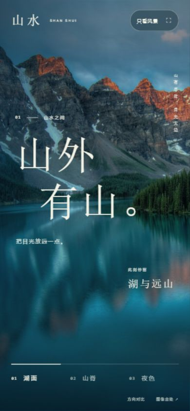

# 山水 · 沉浸长卷

一个原生 HTML/CSS/JavaScript 视觉原型。围绕同一组山水摄影，制作三份结构不同的候选，再把沉浸方向深化为可交互页面。概念题签不是景点名称；没有音频、账户、真实地图或后端服务。

## 运行与体验

从仓库根目录运行：

```sh
python -m http.server 8765 --bind 127.0.0.1 --directory examples/landscape
```

- http://127.0.0.1:8765/ ：沉浸长卷定稿。
- http://127.0.0.1:8765/explorations/ ：三方向比较；点击缩览进入候选页面。

定稿可点击底部章节或桌面前后按钮，也可用键盘左右键切换。右上角“只看风景”收起文字与导航，点击返回或按 Escape 退出。URL 中的 `#lake`、`#ridge`、`#night` 对应章节，刷新后可回到该景。

照片、字体回退与代码均可本地运行，不要求 API 密钥或前端依赖。素材来源链接需要联网访问。

## 阅读流程

1. [需求与三个方向](brief.md)：共同任务、不同结构及定稿取舍。
2. [视觉简报](visual-brief.md)：应保留的表达和具体规则。
3. [实际设计规范](design-system.md)：排版、裁切、动效、响应式和状态。
4. [自查与修订](review.md)：视觉和文案分开记录。
5. [验收记录](acceptance.md)：执行过的检查及限制。
6. [当前状态](status.md)：续接入口。
7. [素材与许可](assets/README.md)：摄影来源和使用边界。

## 页面截图

| 定稿桌面 | 定稿手机 |
| --- | --- |
|  |  |

三候选保留在 `explorations/`，可以实际操作，不用静态截图替代比较。

## 静态检查

安装 Node.js 后，在仓库根目录执行：

```sh
node examples/landscape/verify.cjs
```

检查本地链接、图片引用和 JavaScript 语法，不启动浏览器，也不代表视觉或交互验收。浏览器实际验证范围见验收记录。

案例评审为实现者自查；没有独立评审或真实用户研究背书，不宣称达到生产级上线标准。公开资料仅包含示例实现、设计说明与验证事实。
